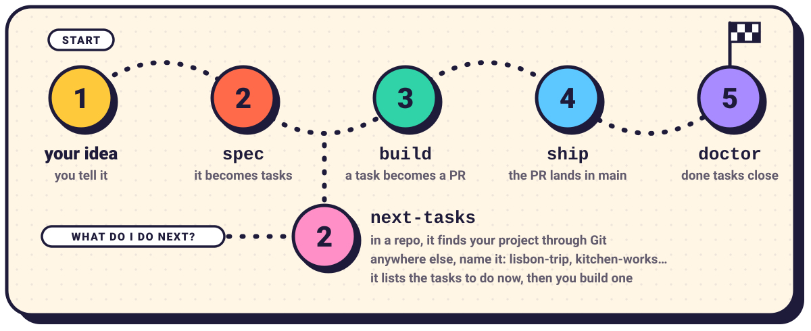

<p align="center">
  
</p>

<p align="center">
  <b>Three plugins for your AI agent.</b><br>
  One paste to install them, one command to run them.
</p>

<br>

## 🏛️ Three plugins

<p align="center">
  
</p>

**nestor** is for everyone, no code needed. **nestor-beta** is for coders and goes on top of nestor. **massdo-skills** stands on its own.

## 🕹️ Install

Pick your agent, copy, paste. Done.
Only want one plugin? Keep just its line.

<details>
<summary><b>Claude Code</b></summary>

```bash
claude plugin marketplace add massdo/massdo-marketplace
claude plugin install nestor@massdo-marketplace
claude plugin install nestor-beta@massdo-marketplace
claude plugin install massdo-skills@massdo-marketplace
```

</details>

<details>
<summary><b>Codex</b></summary>

```bash
codex plugin marketplace add massdo/massdo-marketplace
codex plugin add nestor@massdo-marketplace
codex plugin add nestor-beta@massdo-marketplace
codex plugin add massdo-skills@massdo-marketplace
```

</details>

<details>
<summary><b>Cursor</b></summary>

```bash
git clone https://github.com/massdo/massdo-marketplace.git "$HOME/massdo-marketplace"
mkdir -p "$HOME/.cursor/plugins/local"
ln -sfn "$HOME/massdo-marketplace/plugins/nestor" "$HOME/.cursor/plugins/local/nestor"
ln -sfn "$HOME/massdo-marketplace/plugins/nestor-beta" "$HOME/.cursor/plugins/local/nestor-beta"
ln -sfn "$HOME/massdo-marketplace/plugins/massdo-skills" "$HOME/.cursor/plugins/local/massdo-skills"
```

Then run **Developer: Reload Window**.

</details>

<details>
<summary><b>Kimi Code</b></summary>

```bash
git clone https://github.com/massdo/massdo-marketplace.git "$HOME/massdo-marketplace"
```

Then, in the TUI:

```text
/plugins install ~/massdo-marketplace/plugins/nestor
/plugins install ~/massdo-marketplace/plugins/nestor-beta
/plugins install ~/massdo-marketplace/plugins/massdo-skills
/reload
```

</details>

## 🪄 Use

Type the command in your agent. Each agent has its own accent:

```text
Claude Code   /nestor:tree
Codex         $nestor:tree
Cursor        /tree
Kimi Code     /skill:tree
```

Everything below is written in Claude Code’s accent.

### 📜 nestor · for everyone

Like the old king of Pylos, it remembers everything. Tasks, notes, projects and hours, in plain words. No code needed: mention a task and it shows up on its own.

<p align="center">
  
</p>

A trip, a building site, a client project, a family move: your tasks live in the cloud, not in one agent. Add “book hotel” in Claude Code, Cursor tells you it is next, Codex ticks it off, Kimi Code finds your Lisbon notes.

<p align="center">
  
</p>

Two ways to find them. **Semantic** search understands what you mean, even with other words. **Deterministic** search sticks to exact words, tags and filters, like the tags in Apple Notes, and gives the same list every time. Ask in plain words and nestor mixes both.

- 📓 `/nestor:nestor` — tasks, notes, projects, history
- ⏱️ `/nestor:activity` — start a timer, get your hours
- 🌳 `/nestor:tree` — draws a project as a tree
- ⏸️ `/nestor:pause lisbon-trip` — saves the project’s work context for later
- ▶️ `/nestor:resume lisbon-trip` — restores that context and archives the handoff
- 🔄 `/nestor:check-for-updates` — looks for an update

Invoke `pause` and `resume` explicitly. Omit the project to infer it from the current Git repository. Each pause saves a `workflow-pause` note with summaries of open tasks and notes modified in the last hour or worked on in the conversation. The summaries describe the state at the pause, even when you return eight hours later. Resume reads only the latest handoff, accounts for work already done in the current conversation, and archives that note automatically after preparing the response. It presents the next actions without starting them; archived handoffs remain in Nestor.

> [!NOTE]
> nestor plugs in the only MCP server in the house: `https://journal.mcp-marketplace.org/mcp`

### 💾 nestor-beta · for coders

Nestor learned to code. It takes you from an idea to merged pull requests. Install it **on top of** nestor.

<p align="center">
  
</p>

Two ways in. **New idea?** Start with `spec`. **Not sure what to do next?** Run `next-tasks`: in a repo it finds the project through Git, anywhere else you name it (`/nestor-beta:next-tasks lisbon-trip`), and it lists what to do now.

- 📐 `/nestor-beta:spec` — turns your idea into a task tree, one question at a time
- 📋 `/nestor-beta:next-tasks` — lists a project’s active tasks
- 🏗️ `/nestor-beta:build` — turns a task into a pull request
- 🚢 `/nestor-beta:ship` — merges open PRs into `main` (`ship list` only looks)
- 🩺 `/nestor-beta:doctor` — offers to close tasks that already shipped
- 🧹 `/nestor-beta:clean-task` — tidies up a task
- 🔄 `/nestor-beta:check-for-updates` — looks for an update

Behind the scenes, 🔗 `nestor-beta` signs your pull requests with a `nestor tasks:` footer. Nothing to type.

### 🎭 massdo-skills · for style

Changes how your agent talks to you. A style stays on until `reset`.

- ✂️ `/massdo-skills:answer-short` — short answers, 120 words max
- ✍️ `/massdo-skills:articulate` — full sentences that connect
- 🎯 `/massdo-skills:chief-of-staff` — decides instead of handing you a menu
- 📡 `/massdo-skills:extract-signal` — sorts raw text, then acts on it (`raw` returns the sorted text only)

<br>

<p align="center"><sub>🏛️ Made by massdo</sub></p>
